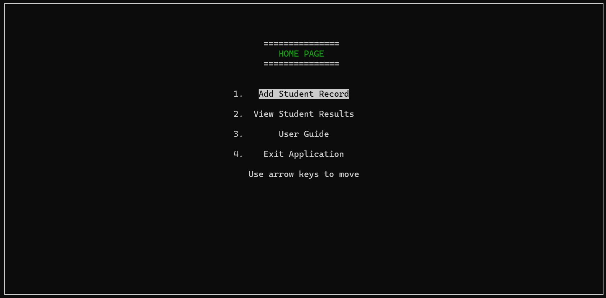
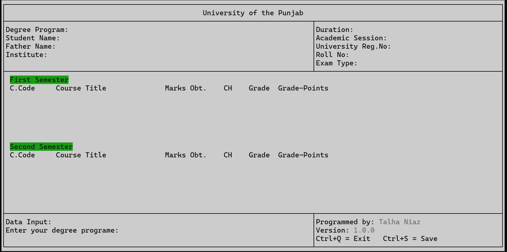
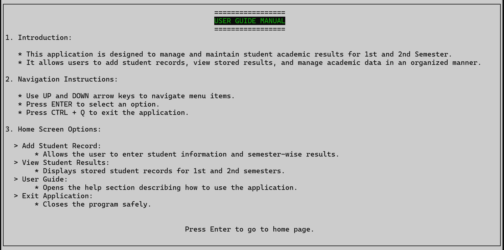

#  Student Result Management System  
*A Console-Based OOP Project Using C++ and PDCurses*

---

## 📌 Overview

The **Student Result Management System** is a console-based application developed in **C++** using core **Object-Oriented Programming (OOP)** principles.  

The system provides a structured **Text User Interface (TUI)** using the **PDCurses** library and allows users to manage student academic records efficiently.

This project demonstrates practical implementation of:

- Classes & Objects  
- Encapsulation  
- Abstraction  
- File Handling  
- Cross-platform compilation  

---

##  Purpose

The purpose of this project is to:

- Manage student academic records
- Store semester-wise results
- Use Roll Number as a unique identifier
- Apply OOP concepts in a real-world scenario
- Practice file handling and structured program design

All records are saved locally in the directory from where the program is executed.

---

##  System Workflow

### 1️ Welcome Screen

When the application starts, a welcome window is displayed using the PDCurses interface.

---

### 2️ Home Menu

The Home Menu provides four main options:

1. Add Student Record  
2. Saved Records  
3. User Manual  
4. Exit Application  


---

##  Features

### 1 Add Student Record

This module allows the user to:

- Enter student personal information  
- Enter academic information  
- Select the number of semesters  
- Define number of subjects per semester  
- Enter subject-wise marks  
- Save student data using Roll Number  

> ⚠ Note: `(Ctrl + S)` shortcut is currently not implemented.



---

### 2  Saved Records

This feature is currently under development.

Planned improvements:
- View saved student records  
- Search by Roll Number  
- Edit existing records  
- Delete records  

---

### 3 User Manual

Provides a brief guide on how to use the system and navigate through the menu options.



---

### 4 Exit Application

Safely closes the application.

---

##  Technologies Used

- **C++**
- **PDCurses Library**
- **Object-Oriented Programming Concepts**
- **File Handling**
- **Visual Studio (Windows)**
- **Visual Studio Code (Linux)**

---

## 💾 Data Storage

- Student data is stored locally in files.
- Roll Number is used as a unique key.
- Files are saved in the program execution directory.

---

## Platform Compatibility

| Platform | Supported |
|----------|------------|
| Windows  | ✅ Yes |
| Linux    | ✅ Yes |

---

##  How to Compile and Run

### 🔹 On Windows

1. Install PDCurses library.
2. Open the project in Visual Studio.
3. Build and run the project.

### 🔹 On Linux

1. Install required libraries.
2. Compile using:

    ```bash
    g++ source/*.cpp -Iheader -lncurses -o my_project.exe